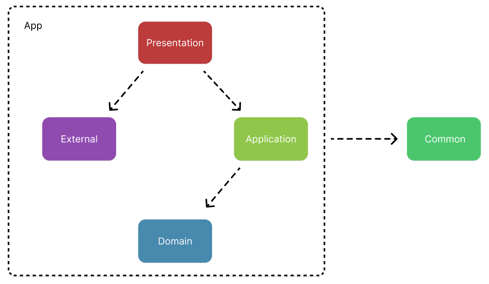

## Commit Rule
- feat 	  	: 기능 개발
- fix 	  	: 기능, 스타일 수정
- docs 	  	: 문서 작성 및 수정
- refactor 	: 코드 리팩토링
- test 	   	: 테스트 코드 작성 및 수정
- chore   	: 빌드 업무 수정, 패키지 매니저 수정


- commit message title 첫글자만 대문자, 나머지는 소문자
- commit message 마지막에 Jira 티켓 번호 추가

```
feat: Create user repository USLERUNG-1
```


## Branch Rule
- 소문자만 사용
- 변경 사항을 포괄하는 내용을 담아서 이름 만들기

```
user-save
connect-slack-user
```

## 환경 구분
- local (개발 서버)
- dev (수시로 막 갖다 붙이는 곳)
- release (백 - 프론트 버전 맞추는 작업)
- prod (운영 서버)

## 모듈 구조



- `common`
- `app`
  - `presentation`
  - `application`
    - `user-application`
    - `schedule-application`
  - `domain`
    - `user-domain`
    - `schedule-domain`
  - `external`
    - `slack`


- `common`: 모든 모듈에서 공통적으로 사용될 수 있는 유틸성 메서드의 집합. 단, common 모듈에 두는 게 맞을까 의심되면 다른 모듈에 두기.
- `app`: 스프링 의존성을 가지는 모듈의 집합
- `presentation`: 외부 클라이언트의 요청을 받는 모듈 & 어플리케이션 빌드의 기준점이므로, 빌드에 필요한 모듈에 대한 의존성을 가짐
- `application`: 비즈니스 로직이 담기는 부분
- `domain`: 비즈니스 로직과 분리, 도메인 고유의 동작을 구현 & 개발 편의성을 위해 DB 의존성을 가짐

## 이벤트 구조
- 서비스 상의 행위를 이벤트로 발행
- 이벤트 구독에 따라 슬랙 메세지 발행
- 현재로서는 슬랙 메세지 발행 뿐, 그 외는 domain 로직 호출을 통해 처리
- 스프링 이벤트를 통한 구현 & 추후 메세지 관련 서비스 이용
